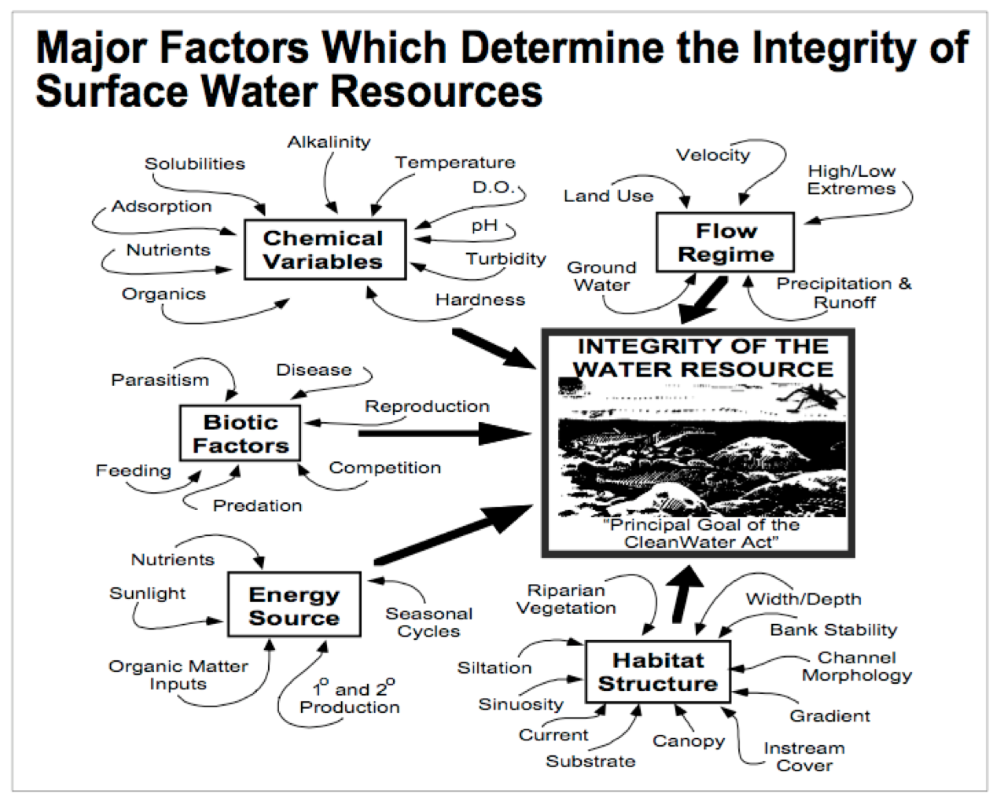

# Intro to Stream Ecology (Week 9)

## Stream ecology 

**Limnology** is the study of inland waterways. When waterways are characterized by flowing water, such as streams, rivers, or estuaries, we refer to them as **lotic** ecosystems. 

```{r, echo = F, fig.align="center", fig.cap="Several **abiotic** and **biotic** factors impact the ecology of lotic ecosystems. A complete listing of these factors is available in Table 1 on page 30 of your lab manual."}

```


### Stream stressors: impervious surfaces {-}

```{r, echo = F}
knitr::include_url("https://www.youtube.com/embed/wZGzqDfoIks")
```

### Stream restoration in Baltimore County {-}

```{r, echo = F}
knitr::include_url("https://www.youtube.com/embed/jIGoCM2sCBM")
```

### Stream stressors: flow alteration {-}

```{r, echo = F}
knitr::include_url("https://www.youtube.com/embed/RgHWO-9nxb8")
```

## Discussion questions 

1. Scientists from the Smithsonian Environmental Research Center use biodiversity assessments to quantify the health of stream habitats. How would you expect an increase in nearby impervious surfaces to affect the **abundance** and **diversity** of stream macroinvertebrates?

2. In Northern Virginia, rapid development has led to increased run-off and subsequent stream erosion. According to the video about Baltimore County stream restoration, what are two methods that are used to restore streams in developed areas?


